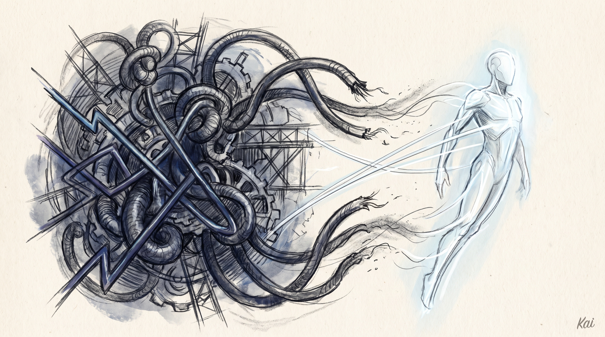

<div align="center">



# LifeOS 7.0.0

**The Bitter Pill Release — stop over-instructing the model and let it think.**

[](../../LifeOS/install/skills/)
[](../../LifeOS/install/LifeOS/ALGORITHM/)
[](../../LifeOS/install/LifeOS/PULSE/)

</div>

---

7.0.0 is the biggest philosophical shift in LifeOS since it started. The last year of the system was spent adding structure — modes, tiers, phase ceremonies, self-scores, reasoning choreography. This release takes most of it back out. The bet is simple: a capable model, given a clear statement of what "done" means and good tools, thinks better without a rulebook telling it how to think. That principle has a name here — Bitter Pill Engineering — and 7.0.0 is what happened when it swept the whole system.

## What's new

### Bitter Pill Engineering

The core test for every instruction in the system: *would a smarter model make this rule unnecessary?* If yes, it was scaffolding, and it got cut. Out went the reasoning choreography, the self-graded numbers no consumer read, the routing prose duplicated from code, and a capabilities file that was mostly stale. What stayed is the load-bearing kernel: verification that closes only on real evidence, the ISA contract, safety gates, and exact tool recipes. Less scaffolding, better output.

### The context got roughly two-thirds smaller

The doctrine that loads on every turn, plus its old companion capabilities file, went from about 88KB to about 28KB. That is not a cosmetic trim. Every token in the always-loaded context is paid on every single turn, so cutting the cold, rarely-used material out of the hot path makes the whole system faster and sharper. The expanded rationale and incident history still exist — they just live in on-demand files that load only when their trigger fires.

### Modes and tiers are gone

There is no longer a MINIMAL / NATIVE / ALGORITHM mode to pick, and no E1–E5 effort tier to declare before starting. A one-line answer and a week-long build are the same loop at different depths. The model reads what is being asked, aims at the right outcome, and spends what hitting it takes — discovered from the work, never predicted from a label. One adaptive response format, one loop.

### The Algorithm (v8.3.0)

The unified thinking system that moves a thing from its current state to its ideal state by climbing a hill defined as you climb it. The ISA — the Ideal State Artifact — is both the hill and the instrument: it states what "done" means as falsifiable claims, each naming the tool probe that would refute it, so the spec *is* the test suite and evidence is altitude. You cannot close a claim you did not verify.

### AlgorithmNudge

A single deterministic nudge layer, fired at the moment a question becomes answerable: a prompt that matches a skill's triggers gets a routing nudge, a run that drifts from its ISA gets a freshness nudge, a run deep into its budget with claims still open gets a spend nudge. Zero inference, sub-20ms, replacing what used to be scattered across several hooks.

### The hook layer was audited and consolidated

Around sixteen hooks were folded into per-event dispatchers, and the whole layer was reviewed for what actually earns its place. Fewer processes, clearer ownership, same enforcement.

### Community fixes

Thanks to the contributors whose fixes ship in this release: a work-events replay race that could double-fold events, DA-name de-hardcoding so a fresh install reflects the name you chose, config-driven Pulse identity, an explicit voice-summary toggle, and absolute-path binary resolution for scheduled callers.

---

## Install

**Give it to your AI.** Paste this into Claude Code and say **"install this"** — your AI does the whole setup.

```bash
curl -fsSL https://ourlifeos.ai/install.sh | bash
```

Prefer the terminal? Run the same command yourself. You'll need **Claude Code** and **bun**. Everything ships inside one self-contained `LifeOS/` skill.
